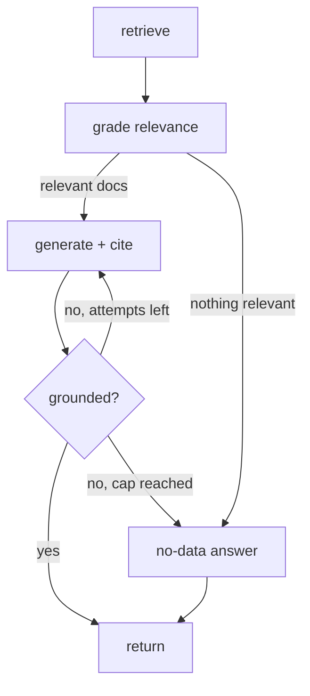

# Agentic RAG

[](https://github.com/Viktor-Skobeliev/agentic-rag/actions/workflows/ci.yml)

A retrieval-augmented question-answering system that **grounds every answer in
sources, refuses to answer when the knowledge base has no answer, and checks its
own output before returning it** — with an offline evaluation harness that
measures whether all of that actually works.

`Python 3.12` · `LangGraph` · `OpenAI` · `Chroma / pgvector` · `pytest + ruff + mypy(strict)` · `CI`

Most RAG demos are "embed a PDF and hope". The interesting problems are the ones
this repo focuses on: **relevance filtering, grounded citations, honest
"I don't know", a self-correction loop, and measuring answer quality.**

---

## How it works

The pipeline is a LangGraph state machine. The self-check loop is what makes it
*agentic*: if the answer is not supported by the retrieved documents, it
regenerates (up to a cap) and otherwise falls back to an honest no-data answer
rather than shipping an unsupported claim.



| Step | What it does | Why it matters |
|------|--------------|----------------|
| **retrieve** | embed the question, nearest-neighbour search | recall |
| **grade** | an LLM keeps only documents that actually help | kills off-topic context |
| **generate** | answer strictly from kept documents, with citations | grounding |
| **check** | verify every claim is supported | hallucination guard |
| **no-data** | when nothing supports an answer, say so | honesty over confident wrong answers |

## Design notes

- **Pluggable vector store behind one interface.** `VectorStore` has two
  implementations — **Chroma** (zero-setup, runs after `git clone`) and
  **pgvector** (matches production Postgres setups). Swapping them is a config
  change; the graph never imports a concrete store.
- **Provider calls behind small interfaces** (`Embedder`, `RagLLM`), so the
  graph depends on protocols, not a vendor SDK — and the whole pipeline runs in
  tests with fakes, no network.
- **Deterministic where it counts.** Grading, generation and the grounding check
  run at temperature 0; the flow control and the eval scoring are plain, tested
  code.

## Quickstart

```bash
uv pip install -e ".[dev]"
cp .env.example .env          # add your OPENAI_API_KEY

agentic-rag ingest docs       # chunk, embed and load the sample knowledge base
agentic-rag ask "What are the core working hours?"
# -> Core hours are 11:00 to 15:00 UTC.
#    Sources: remote-work-0

agentic-rag ask "What is the office pet policy?"
# -> I could not find an answer to this in the knowledge base.
```

Use Postgres instead of Chroma:

```bash
docker compose up -d
VECTOR_BACKEND=pgvector agentic-rag ingest docs
```

## Evaluation

`eval/eval_set.yaml` holds questions with expected sources and key facts, plus
deliberately unanswerable questions. The harness reports three metrics:

```bash
python eval/run_eval.py
```

- **retrieval hit-rate** — was the document holding the answer retrieved?
- **groundedness** — is the answer supported and does it contain the key fact?
- **no-data handling** — for unanswerable questions, does it correctly abstain?

Scoring is pure and unit-tested, so a prompt or retrieval change turns into a
measurable delta instead of a vibe.

## Tests

```bash
make check   # ruff + mypy(strict) + pytest
```

**53 tests plus 8 eval scenarios, all offline** with fake embedder / store / LLM —
no network, no API key needed. They cover chunking, the embedder and LLM JSON
parsing, both vector stores, every graph node and routing branch, and the graph
end to end: the happy path, the no-relevant-documents path, the regenerate-on-
ungrounded loop, and the fallback after the attempt cap.

## Layout

```
src/agentic_rag/
  chunking.py         recursive splitter with overlap
  embeddings.py       Embedder interface + OpenAI implementation
  vectorstore/        VectorStore interface + Chroma + pgvector
  llm.py              grade / generate / check-grounding behind one interface
  nodes.py graph.py   LangGraph nodes and wiring
  ingest.py cli.py    ingestion + command line
eval/                 eval set + scoring harness
tests/                offline tests with fakes
```
